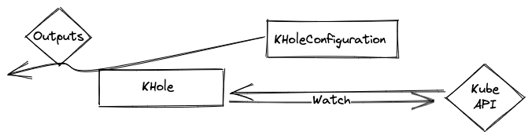
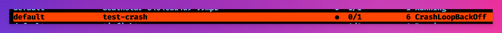
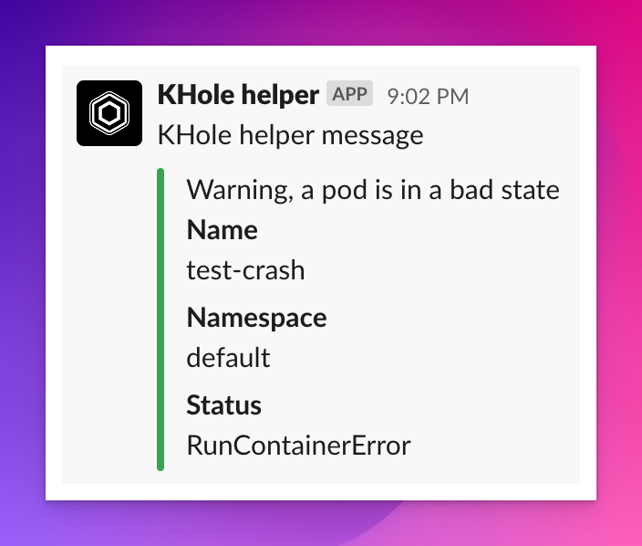

# KHole 

Sends alerts from crashed K8s pods to Slack. This is a simple tool that can be used to monitor your Kubernetes cluster.



```
apiVersion: core.cloudnativeskunkworks.io/v1alpha1
kind: KHoleConfiguration
metadata:
  name: kholeconfiguration
spec:
  output:
    slack:
      channelID: ""
      token: ""
```

## Example

When a pod crashes or doesn't work properly, KHole will send a message to the configured outputs.



An example Slack message



### Installation

```
kubectl apply -f https://github.com/cloud-native-skunkworks/khole/releases/download/latest/release.yaml
```

Apply the CR with your details

```
kubectl apply -f config/samples/core_v1alpha1_kholeconfiguration.yaml
```

### Development

This is a typical kubebuilder project. 
It has no webhook so you can just `go run` as long as you have a valid `KUBECONFIG` env. You'll need to install the custom resources.

If you want to build the docker image just override the `IMG` env variable in the make file e.g. `IMG=your-registry/khole:latest make docker-build`

### Contributing

Things that you could do to make this better

- [ ] Add more outputs
- [ ] Add some more protection/guards to code logic
- [ ] Add some tests


If you have an idea but no idea how to implement it, message me on CNCF slack (Alex Jones)